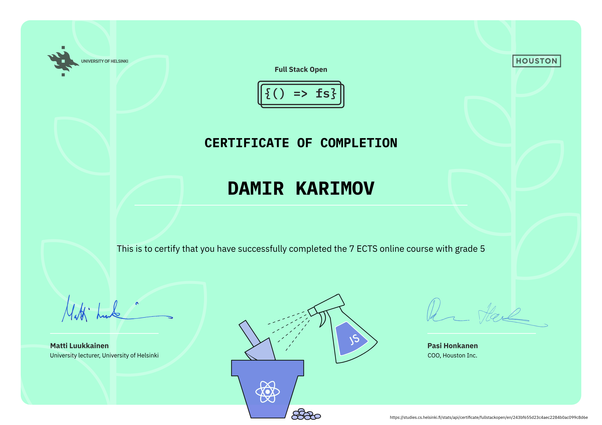
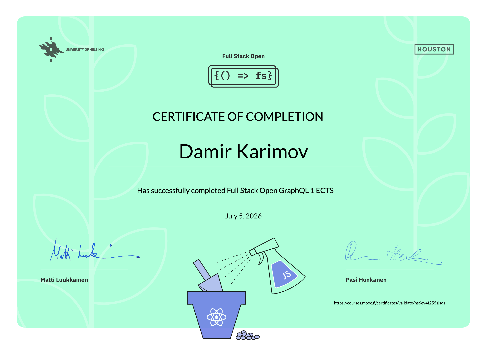
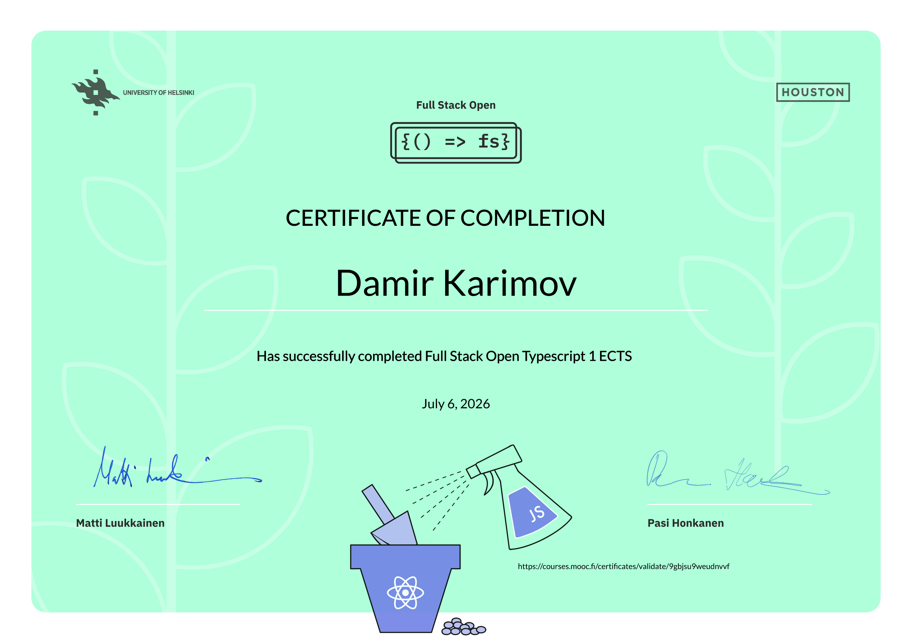

# Full Stack Open

**University of Helsinki** · MOOC · **9 ECTS total**

*Course exercises repository. Personal projects coming soon.*

---

### Live demo

## Certificates

<table>
  <tr>
    <td align="center" width="33%">
      
        
      <strong>Full Stack Open</strong> · 7 ECTS · grade 5
       
      <a href="https://studies.cs.helsinki.fi/stats/api/certificate/fullstackopen/en/243bf655d23c4aec2284b0ac099c8d6e">Verify certificate →</a>
    </td>
    <td align="center" width="33%">
      
        
      <strong>GraphQL</strong> · 1 ECTS
       
      <a href="https://courses.mooc.fi/certificates/validate/hs6ey4f255sjsds">Verify certificate →</a>
    </td>
    <td align="center" width="33%">
      
        
      <strong>TypeScript</strong> · 1 ECTS
       
      <a href="https://courses.mooc.fi/certificates/validate/9gbjsu9weudnvvf">Verify certificate →</a>
    </td>
  </tr>
</table>

---

**Damir Karimov**

[fullstackopen.com](https://fullstackopen.com/) · [courses.mooc.fi](https://courses.mooc.fi/)

